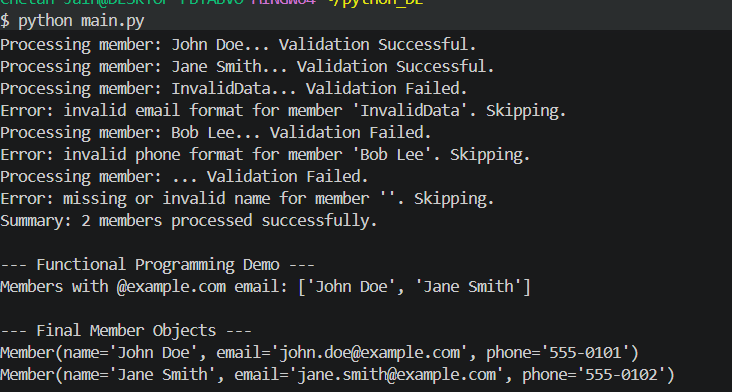

# My Processor Package

This is a modular core concepts assignment utility.

## Installation
```bash
pip install dist/my_processor-0.1.0-py3-none-any.whl
```

## Usage
```python
from my_processor import Processor



```